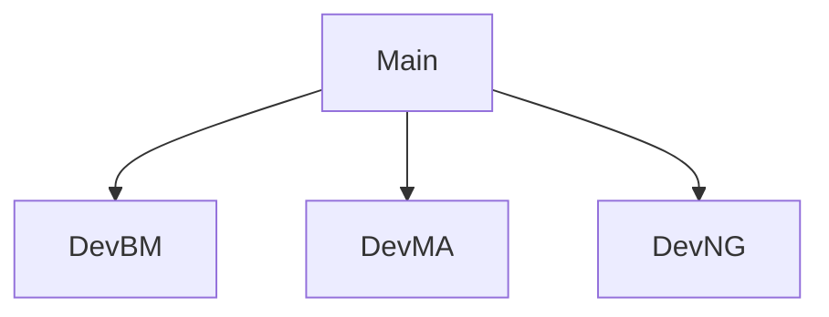

# Ascending Intelligence 
## Prototype One
### Overview

The initial prototype of Ascending Intelligence will focus on the integration of OpenSMILE to the Microphone input, and creating dynamic visuals based on the output of the telemetry. 

### Requirements

- [TouchDesigner v2023.12370](https://derivative.ca/download) (Non-Commercial is suitable for testing, Developed on the Commercial License)
- [Python 3.11.9](https://www.python.org/downloads/)

### Documents

- [Trello](https://trello.com/b/pRlLVtaa/ascending-intelligence-cg2-project-plan)
- [GDrive](https://drive.google.com/drive/u/0/folders/1yXpYEQyLcP0t8pXBpN6pFj6vftRJXKm4?ths=true)
- [XMind](https://xmind.ai/share/HIdG5JTK?xid=1MG3EB8p)

### Setup

1. Install TouchDesigner
2. Install Python
3. Download this Repository
4. `cd` into the downloaded repo
5. In Terminal create the Virtual Environment
    1. `python -m venv venv`
    2. `./venv/Scripts/activate` to activate the Virtual Environment
    3. `pip install -r requirements.txt`
    4. Install the PyTorch version that matches [your system](https://pytorch.org/get-started/locally/)
        1. If you do not have a GPU, select Stable, Pip, Python, CPU
        2. If you have a GPU, select Stable, Pip, Python, CUDA (Version)
6. Open the ./touchdesigner/*.toe file
7. Activate the Python Manager Operator (marked yellow)
    1. Set Python Executable > Pulse
    2. Point to venv directory > Base Folder
    3. Add venv to system path
    4. Print venv Report (Upon success you should see a list of the installed Python Libraries, including OpenSMILE)
8. Change to your Git Branch - `git checkout -b dev-[initials]`
9. Copy the `.env_template` file to `.env` and place your API Keys in this file. Do not commit this to the repo. 

### Web Setup

This instruction creates a new virtual environment for the web server implementation of the OpenSMILE model

1. `python -m venv webvenv`
2. `.\webvenv\Scripts\activate`
3. `cd webserver`
4. `pip install -r requirements.txt`
5. `quart run --reload`
6. Open website `http://127.0.0.1:5000`

### TouchDesigner Python Modifications

In order to run Scikit on TouchDesigner (OpenSMILE component) it is necessary to update numpy on the TouchDesigner Python implementation. 

1. `C:\Program Files\Derivative\TouchDesigner\bin\python.exe -m pip install "numpy==1.26.4" scikit-learn` 

### Branching Structure

### Repo Structure

TouchDesigner will relatively reference this file structure. If changing the structure please notify the team.

- / - configuration files
- /python - Python files
- /touchdesigner - TouchDesigner Files
- /venv - (.gitignore, Do not upload to repo) Python Virtual Environment files
- /Backup - (.gitignore, Do not upload to repo) TouchDesigner Backup files

### DMX

- ./touchdesigner/promptGenerator.toe contains the DMX Output to the local network. This can be updated when the final network is configured and DMX Fixtures are in place. 
- During development we are simulating on [Capture 2025](https://www.capture.se/Downloads/Download-Capture) with a Generic RGB Par Can Fixture on Universe 1 channels 1-6, localhost network. 

### Billing

- [Elevenlabs Billing](https://elevenlabs.io/app/subscription)
- [OpenAI Billing](https://platform.openai.com/settings/organization/billing/overview)
    - Auto re-bill upon token threshold

### Credits

- ElevenLabs TOX created by Torin Blankensmith
- OpenAI TOX created by Torin Blankensmith
- Whisper Component by Torin Blankensmith